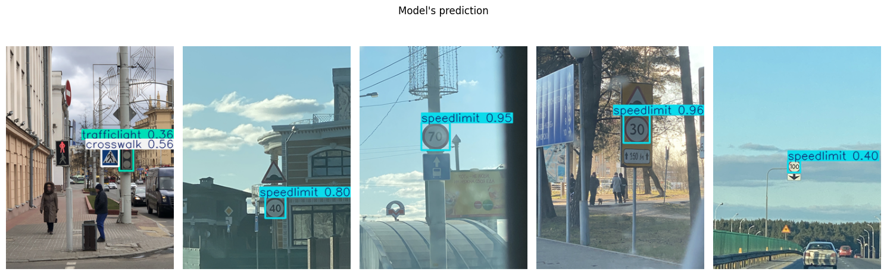
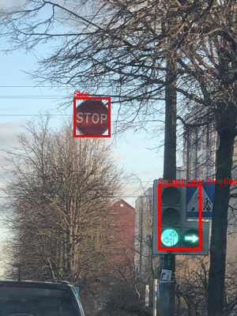

## Opis projektu
Projekt łączy detekcję obiektów (YOLOv8) z optycznym rozpoznawaniem znaków (TrOCR), aby automatycznie wykrywać znaki drogowe na zdjęciach i odczytywać wartości z ograniczeń prędkości. 

## Działanie

Rozpoznawane klasy znaków:
- `stop` (Znak STOP)
- `speedlimit` (Ograniczenie prędkości)
- `crosswalk` (Przejście dla pieszych)
- `trafficlight` (Sygnalizacja świetlna)

## Wykorzystane modele
- **YOLOv8** (Ultralytics) - do precyzyjnej lokalizacji znaków drogowych na obrazie.
- **TrOCR** (`microsoft/trocr-base-printed` od Hugging Face) - do odczytywania liczb z wyciętych (zdetekowanych) znaków ograniczenia prędkości.

## Pliki i struktura projektu
- `dataset.yaml` - konfiguracja ścieżek i klas dla modelu YOLO.
- `podzialDanych.ipynb` - skrypt do dzielenia zbioru danych na zbiór treningowy i walidacyjny.
- `trenowanie.ipynb` / `model.ipynb` - pobieranie zbioru danych (Kagglehub: `andrewmvd/road-sign-detection`), konwersja etykiet z XML do formatu YOLO i trening modelu.
- `testRozpoznanie.ipynb` - testowanie wytrenowanego modelu YOLO na przykładowych zdjęciach i generowanie predykcji.
- `model+syntezatorv2.ipynb` - główny skrypt łączący predykcję YOLO z modelem TrOCR do rozpoznawania i nakładania odczytanej prędkości na obraz.
- `yolo26n.pt` - przykładowe wagi modelu YOLO.

## Instalacja
Wymagane pakiety możesz zainstalować poleceniem:

Jak uruchomić?
- Uruchom podzialDanych.ipynb, aby przygotować odpowiednią strukturę plików dla YOLO.
- Użyj trenowanie.ipynb, aby wytrenować swój model (wagi domyślnie zapiszą się w runs/detect/train.../weights/best.pt).
- Uruchom model+syntezatorv2.ipynb, podając ścieżkę do wytrenowanych wag oraz obrazu testowego, aby zobaczyć pełny pipeline (Detekcja + OCR).
""")
print("README generated successfully.")